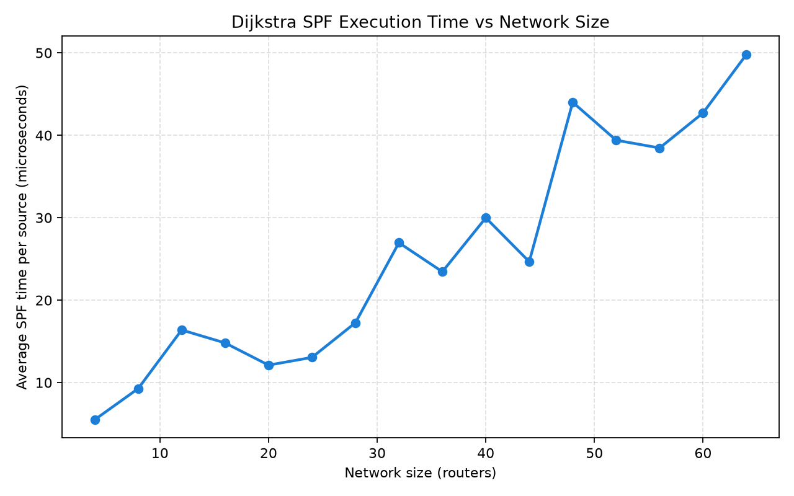
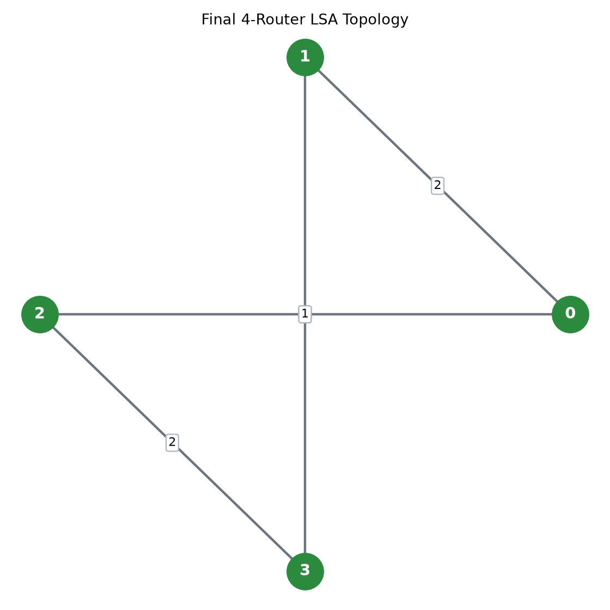

Absolutely. Below is a **complete `README.md`** tailored to the project you actually built. It avoids unnecessary textbook-style content and focuses on your implementation, outputs, experiments, and commands.

Create a new file named **`README.md`** in your repository and paste this:

````markdown
# Dijkstra Link-State Routing Engine with LSA Flooding Simulation

## Project Overview

This project is a simulation of a link-state routing system. It demonstrates how routers share information about their directly connected links using Link-State Advertisements (LSAs), how the information is flooded through the network, and how each router can use the collected information to calculate shortest paths using Dijkstra's Shortest Path First (SPF) algorithm.

The project was implemented mainly in C++, with Python used for result analysis and visualization.

The simulation also includes topology changes such as link failure and link restoration. After a topology change, new LSAs are generated and flooded, the LSDBs are updated, and the shortest paths are recalculated.

---

## Objectives

The main objectives of the project are:

- Simulate routers and weighted network links.
- Generate Link-State Advertisements (LSAs).
- Flood LSAs between neighbouring routers.
- Maintain and synchronize Link-State Databases (LSDBs).
- Simulate network topology changes.
- Recalculate routes after topology changes.
- Implement Dijkstra SPF for shortest-path calculation.
- Generate routing tables.
- Measure SPF execution time for different network sizes.
- Measure flooding/convergence iterations.
- Export experimental results to CSV files.
- Visualize the results using Python and Matplotlib.

---

## Technology Stack

- **C++17** - Network simulation, LSA flooding, LSDB handling, Dijkstra SPF and performance measurements.
- **Python 3** - Result analysis and visualization.
- **Pandas** - Reading and processing CSV result files.
- **Matplotlib** - Generating graphs.
- **Git / GitHub** - Source-code and project submission.

---

## Project Structure

```text
Dijkstra-LSA-Simulator/
│
├── main.cpp
│
├── Network.cpp
├── Network.h
│
├── Router.cpp
├── Router.h
│
├── LSA.cpp
├── LSA.h
│
├── dijikra.py
│
├── topology.csv
├── routing_tables.csv
├── spf_results.csv
├── convergence_results.csv
│
├── topology_graph.png
├── spf_execution_time.png
└── convergence_iterations.png
````

### Source files

| File                      | Purpose                                                                              |
| ------------------------- | ------------------------------------------------------------------------------------ |
| `main.cpp`                | Creates the network and runs the complete simulation                                 |
| `Network.cpp / Network.h` | Handles the network, links, flooding, LSDB synchronization, topology changes and SPF |
| `Router.cpp / Router.h`   | Represents routers and their connected links                                         |
| `LSA.cpp / LSA.h`         | Represents Link-State Advertisements                                                 |
| `dijikra.py`              | Reads topology/results and performs Dijkstra analysis and visualization              |

---

## Network Used in the Demonstration

The initial demonstration uses four routers:

```text
       2
  0 ------- 1
  |         |
  | 5       | 1
  |         |
  2 ------- 3
       2
```

The links are:

```text
0 <-> 1   Cost = 2
0 <-> 2   Cost = 5
1 <-> 3   Cost = 1
2 <-> 3   Cost = 2
```

The link cost represents the weight used by Dijkstra's algorithm.

---

## LSA Generation and Flooding

Each router generates an LSA containing information about its directly connected neighbours and link costs.

For example, Router 3 initially advertises:

```text
Router 3
    -> Router 2 | Cost 2
    -> Router 1 | Cost 1
```

The LSA is then flooded through neighbouring routers.

The simulation prints the flooding process so that the propagation of an LSA can be observed.

Example:

```text
LSA 3#1 - Flooding round 1:
    3 -> 2
    3 -> 1

LSA 3#1 - Flooding round 2:
    2 -> 0

LSA 3#1 converged in 3 flooding rounds.
```

Sequence numbers are used for successive versions of LSAs. For example:

```text
LSA #1
LSA #2
LSA #3
```

when the topology changes and new LSAs are generated.

---

## Link-State Database (LSDB)

Every router maintains an LSDB containing the latest LSAs it has received.

After flooding completes, the routers have the information required to reconstruct the network topology.

The simulator also checks whether the routers have synchronized LSDB information.

This allows the project to demonstrate the basic idea of a link-state routing protocol:

```text
Router
  ↓
Generate LSA
  ↓
Flood LSA
  ↓
Neighbour routers receive it
  ↓
LSDB updated
  ↓
Network topology becomes known
```

---

## Topology Change Simulation

The project demonstrates a link failure by removing the link:

```text
1 <-> 3
```

The simulator then generates new LSAs and floods the updated information.

Before the failure, Router 0 reaches Router 3 through:

```text
0 -> 1 -> 3
```

with total cost:

```text
2 + 1 = 3
```

After the link `1 <-> 3` is removed, that route is no longer available.

Router 0 instead uses:

```text
0 -> 2 -> 3
```

with cost:

```text
5 + 2 = 7
```

The routing information is therefore recalculated based on the new topology.

The project then restores the link:

```text
1 <-> 3
```

and the original shorter route becomes available again.

---

## Dijkstra SPF

Dijkstra's Shortest Path First algorithm is used to calculate the shortest path from each router to the other routers.

The implementation uses a priority queue to process the router with the currently smallest known distance.

The basic process is:

```text
Select source router
       ↓
Set source distance = 0
       ↓
Select router with minimum distance
       ↓
Check its neighbours
       ↓
Update shorter distances
       ↓
Continue until all reachable routers are processed
       ↓
Generate shortest paths
       ↓
Create routing table
```

---

## Example Routing Result

For Router 0, the initial topology produces:

```text
Destination    Next Hop    Cost    Path

1              1           2      0 -> 1
2              2           5      0 -> 2
3              1           3      0 -> 1 -> 3
```

The path to Router 3 is:

```text
0 -> 1 -> 3
```

because:

```text
2 + 1 = 3
```

which is cheaper than:

```text
0 -> 2 -> 3
5 + 2 = 7
```

---

## Routing Tables

Routing tables are exported to:

```text
routing_tables.csv
```

The table contains information such as:

```text
Destination
Next Hop
Cost
Path
```

This shows how the shortest-path calculation can be converted into forwarding information.

---

## Performance Measurement

The project measures the execution time of the C++ SPF implementation for different network sizes.

The experiment uses synthetic networks of different sizes, including:

```text
4
8
12
16
...
64 routers
```

The SPF execution time is measured using a high-resolution C++ timer.

The measured results are stored in:

```text
spf_results.csv
```

Example results include:

```text
Routers     Avg SPF time (µs)

4           3.80
8           5.65
16          11.96
32          20.62
64          42.38
```

The execution time generally increases as the number of routers increases. Small variations between individual measurements are expected because the measured times are very small and can be affected by normal system-level timing variation.

### SPF Execution Time



---

## Convergence Measurement

The simulator also records flooding/convergence iterations for different network sizes.

For this project, convergence iterations represent the flooding iterations used by the simulation to distribute updated link-state information and synchronize the routers.

The results are stored in:

```text
convergence_results.csv
```

Example results:

```text
Routers     Average Iterations

4           8.00
8           30.00
16          77.60
32          201.60
64          496.40
```

All tested network sizes reported successful synchronization.

### Convergence Graph


---

## Network Visualization

The Python program also generates a visualization of the network topology.

### Topology



---

## Output Files

The project generates the following result files:

| File                         | Description                           |
| ---------------------------- | ------------------------------------- |
| `topology.csv`               | Network topology and link information |
| `routing_tables.csv`         | Calculated routing tables             |
| `spf_results.csv`            | SPF timing measurements               |
| `convergence_results.csv`    | Convergence/flooding measurements     |
| `topology_graph.png`         | Network topology visualization        |
| `spf_execution_time.png`     | SPF performance graph                 |
| `convergence_iterations.png` | Convergence graph                     |

---

## Running the Project

### 1. Compile the C++ program

Open a terminal in the project directory and run:

```powershell
g++ main.cpp Network.cpp Router.cpp LSA.cpp -std=c++17 -O2 -o routing_simulator.exe
```

### 2. Run the C++ simulation

```powershell
.\routing_simulator.exe
```

The program performs:

```text
Network creation
       ↓
LSA generation
       ↓
LSA flooding
       ↓
LSDB synchronization
       ↓
Dijkstra SPF
       ↓
Routing tables
       ↓
Topology change
       ↓
New LSA flooding
       ↓
Updated routing
       ↓
Performance measurements
       ↓
CSV results
```

### 3. Run the Python analysis

Make sure Python and the required packages are installed:

```powershell
python -m pip install pandas matplotlib
```

Then run:

```powershell
python dijikra.py
```

The Python program reads the generated CSV files and produces the PNG visualizations.

---

## Testing

The project was tested using the following scenarios:

### Initial network

The four-router topology was created and LSAs were generated and flooded.

### Link failure

The link:

```text
1 <-> 3
```

was removed.

The network generated updated LSAs and recalculated routes.

### Link restoration

The same link was added back.

The routing information was recalculated and the shorter route became available again.

### Different network sizes

SPF timing and convergence measurements were performed for networks ranging from 4 to 64 routers.

The experiments produced CSV files and corresponding graphs.

---

## Results

The simulation successfully demonstrates the complete link-state routing flow:

```text
Network topology
       ↓
LSA generation
       ↓
LSA flooding
       ↓
LSDB synchronization
       ↓
Dijkstra SPF
       ↓
Routing tables
```

After a topology change:

```text
Link failure
       ↓
Updated LSA
       ↓
Flooding
       ↓
Updated LSDB
       ↓
SPF recalculation
       ↓
New routing table
```

The performance experiment also shows that SPF execution time generally increases with network size, while the number of flooding iterations increases as the simulated network becomes larger.

---

## References

1. James F. Kurose and Keith W. Ross, *Computer Networking: A Top-Down Approach*, Pearson.

2. Andrew S. Tanenbaum and David J. Wetherall, *Computer Networks*, Pearson.

3. E. W. Dijkstra, "A Note on Two Problems in Connexion with Graphs", *Numerische Mathematik*, 1959.

4. ISO/IEC, *Programming Language C++* documentation and language references.

5. Python Documentation - Python 3 Documentation.

6. Matplotlib Documentation - Python plotting and visualization library.

7. Pandas Documentation - Python data analysis library.

````

### One recommendation before you commit it

After creating `README.md`, run:

```powershell
git status
````

Then:

```powershell
git add README.md
git commit -m "Add project documentation and results"
git push origin main
```

Then open the GitHub repository. **The README will automatically appear on the repository's front page**, with your three graphs displayed directly underneath the relevant sections.

That gives you a much more complete submission: **source code + actual CSV results + actual graphs + reproducible commands + references**, without needing a separate report unless your college later explicitly asks for one.
