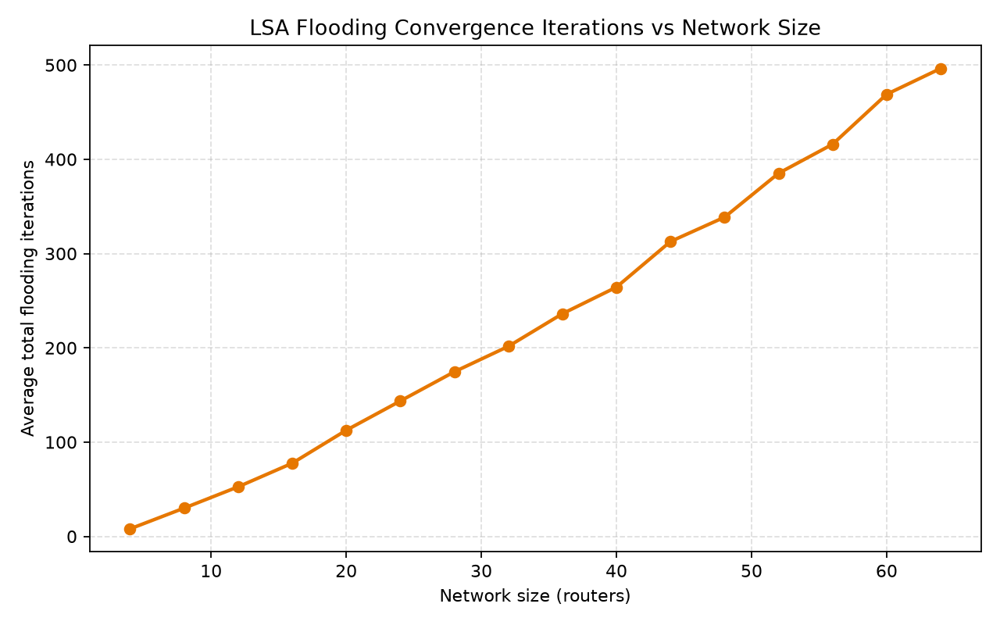

# Dijkstra Link-State Routing Simulator

## Overview

This project is a simulation of a link-state routing protocol. It demonstrates how routers exchange Link-State Advertisements (LSAs), flood the information through the network, maintain Link-State Databases (LSDBs), and calculate shortest paths using Dijkstra's Shortest Path First (SPF) algorithm.

The main simulation is implemented in C++, while Python is used for analysing the results and generating visualizations.

The project also demonstrates what happens when a network link fails and is later restored. After a topology change, new LSAs are generated, flooded through the network, and the routing tables are recalculated.

## Objectives

- Simulate routers and weighted network links
- Generate and flood Link-State Advertisements
- Maintain Link-State Databases
- Simulate link failure and restoration
- Calculate shortest paths using Dijkstra's algorithm
- Generate routing tables
- Measure SPF execution time
- Measure LSA flooding and convergence
- Export results to CSV files
- Visualize results using Python and Matplotlib

## Technologies Used

- C++17
- Python 3
- Pandas
- Matplotlib
- Git and GitHub

## Project Structure

```
Dijkstra-LSA-Simulator/
│
├── results/
│   ├── convergence_results.csv
│   ├── routing_tables.csv
│   ├── spf_results.csv
│   └── topology.csv
│
├── visualization/
│   ├── convergence_iterations.png
│   ├── spf_execution_time.png
│   └── topology_graph.png
│
├── LSA.cpp
├── LSA.h
├── main.cpp
├── Network.cpp
├── Network.h
├── Router.cpp
├── Router.h
├── dijkstra.py
├── README.md
├── .gitignore
└── routing_simulator.exe
```

## Main Source Files

| File | Description |
|---|---|
| main.cpp | Creates the network and runs the simulation |
| Network.cpp / Network.h | Handles the network, links, LSA flooding, topology changes and routing |
| Router.cpp / Router.h | Represents routers and their connected links |
| LSA.cpp / LSA.h | Handles Link-State Advertisements |
| dijkstra.py | Analyses the generated results and creates graphs |

## Network Topology

The initial demonstration uses four routers.

```
        2
       / \
      /   \
     0     3
      \   /
       \ /
        1
```

The links used in the simulation are:

```
0 <-> 1   Cost = 2
0 <-> 2   Cost = 5
1 <-> 3   Cost = 1
2 <-> 3   Cost = 2
```

The link cost is used as the weight in Dijkstra's shortest-path calculation.

## LSA Flooding

Each router generates an LSA containing information about its directly connected neighbours and link costs.

For example, Router 3 can advertise:

```
Router 3
    -> Router 2 | Cost 2
    -> Router 1 | Cost 1
```

The LSA is then flooded through neighbouring routers until the link-state information reaches the other routers.

The simulation uses LSA sequence numbers so that newer information can be distinguished from older information.

## Link-State Database

Each router maintains an LSDB containing the latest LSAs it has received.

The basic process is:

```
Router
   ↓
Generate LSA
   ↓
Flood LSA
   ↓
Neighbours receive LSA
   ↓
LSDB updated
   ↓
Network topology becomes known
   ↓
Dijkstra SPF
   ↓
Routing table
```

## Topology Change

The project also demonstrates a link failure.

The link:

```
1 <-> 3
```

is removed from the network.

Before the failure, Router 0 can reach Router 3 using:

```
0 -> 1 -> 3
```

with a total cost of:

```
2 + 1 = 3
```

After the link fails, the simulator generates updated LSAs and recalculates the routes.

Router 0 can then use:

```
0 -> 2 -> 3
```

with a cost of:

```
5 + 2 = 7
```

The link is later restored and the shorter route becomes available again.

## Dijkstra SPF

Dijkstra's algorithm is used to calculate the shortest path from each router to the other routers.

The basic process is:

```
Select source router
        ↓
Set source distance to 0
        ↓
Select router with minimum distance
        ↓
Check neighbouring routers
        ↓
Update shorter distances
        ↓
Continue until all reachable routers are processed
        ↓
Generate shortest paths
        ↓
Create routing table
```

The C++ implementation uses a priority queue to process the router with the smallest known distance.

## Example Routing Result

For Router 0, the initial topology gives:

| Destination | Next Hop | Cost | Path |
|---|---|---|---|
| 1 | 1 | 2 | 0 -> 1 |
| 2 | 2 | 5 | 0 -> 2 |
| 3 | 1 | 3 | 0 -> 1 -> 3 |

The path to Router 3 is:

```
0 -> 1 -> 3
```

because its cost is:

```
2 + 1 = 3
```

which is lower than:

```
0 -> 2 -> 3
5 + 2 = 7
```

## Results

The simulator generates CSV files containing the network and routing results.

They are stored in the `results` folder:

- `topology.csv` - Network topology and link information
- `routing_tables.csv` - Calculated routing tables
- `spf_results.csv` - SPF execution time measurements
- `convergence_results.csv` - Flooding and convergence measurements

## Visualizations

The generated graphs are stored in the `visualization` folder.

### Network Topology


### SPF Execution Time


### Convergence Iterations



### Performance Measurement

The project measures the execution time of the SPF algorithm for different network sizes.

The experiment uses networks ranging from 4 to 64 routers.

The results are stored in `results/spf_results.csv`.

The execution time generally increases as the network size increases.

### Convergence Measurement

The simulator also records the number of flooding iterations required for the network to synchronize after link-state information is exchanged.

The results are stored in `results/convergence_results.csv`.

The generated graph can be found in `visualization/convergence_iterations.png`.

## How to Run

### 1. Compile the C++ program

Open a terminal in the project directory and run:

```
g++ main.cpp Network.cpp Router.cpp LSA.cpp -std=c++17 -O2 -o routing_simulator.exe
```

### 2. Run the simulator

```
.\routing_simulator.exe
```

The program creates the network, performs LSA flooding, synchronizes the LSDBs, calculates shortest paths, simulates topology changes, and generates the required results.

### 3. Run the Python analysis

Install the required Python packages:

```
python -m pip install pandas matplotlib
```

Then run:

```
python dijkstra.py
```

The Python script reads the CSV files and generates the visualization graphs.

## Testing

The project was tested using the following scenarios:

### Initial Network

The four-router topology is created and LSAs are generated and flooded.

### Link Failure

The link:

```
1 <-> 3
```

is removed and the routing information is recalculated.

### Link Restoration

The same link is added back and the shorter route becomes available again.

### Different Network Sizes

SPF execution time and convergence measurements are performed for different network sizes, ranging from 4 to 64 routers.

## Conclusion

This project demonstrates the basic operation of a link-state routing protocol, including LSA generation, LSA flooding, LSDB synchronization, topology changes, and Dijkstra-based shortest-path calculation.

It also provides simple performance measurements and visualizations to show how SPF execution time and convergence change as the network size increases.

## References

- James F. Kurose and Keith W. Ross, *Computer Networking: A Top-Down Approach*, Pearson.
- Andrew S. Tanenbaum and David J. Wetherall, *Computer Networks*, Pearson.
- E. W. Dijkstra, "A Note on Two Problems in Connexion with Graphs", *Numerische Mathematik*, 1959.
- Python Documentation
- Matplotlib Documentation
- Pandas Documentation
